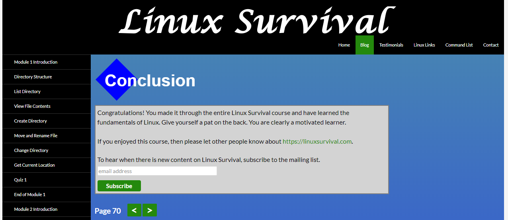
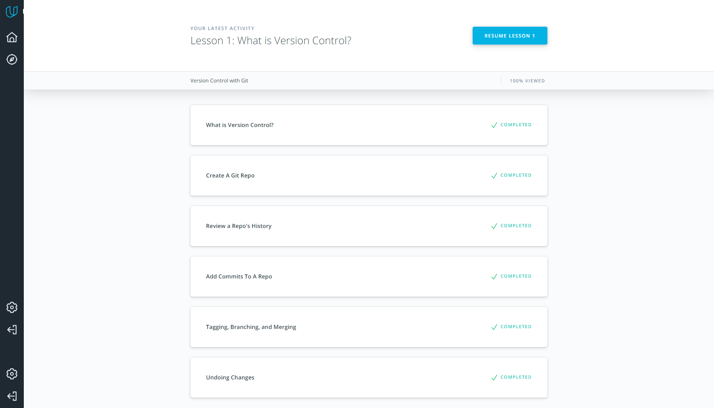
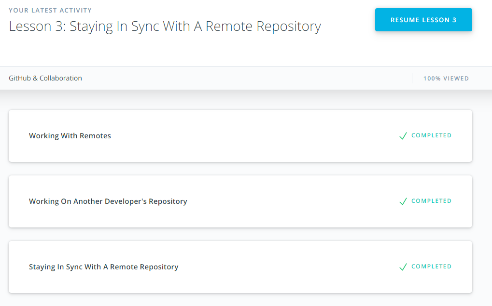
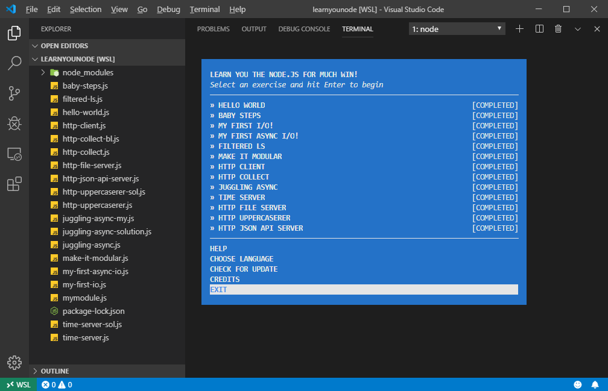
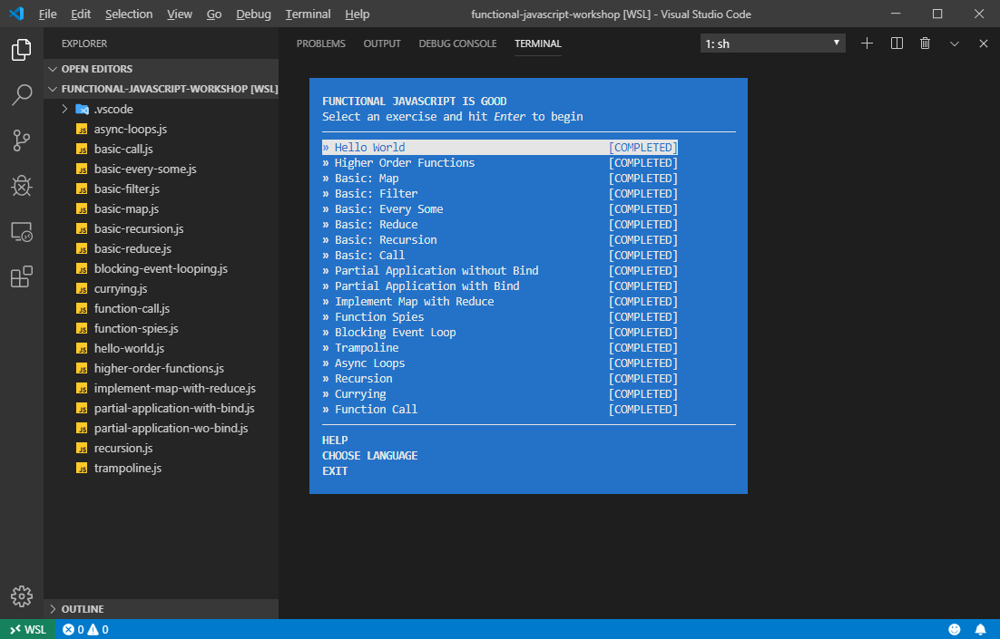
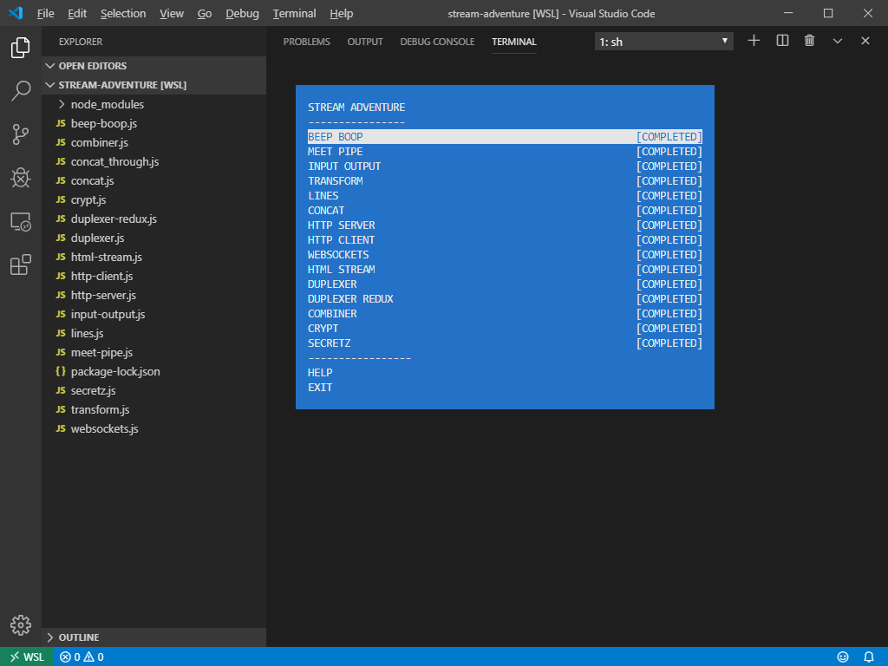
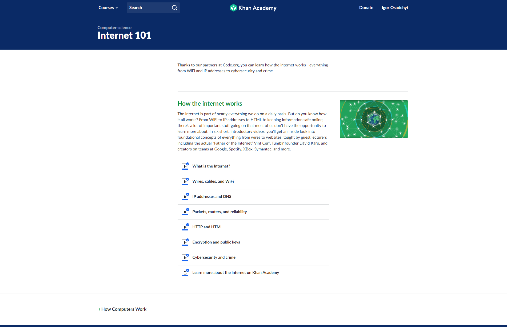
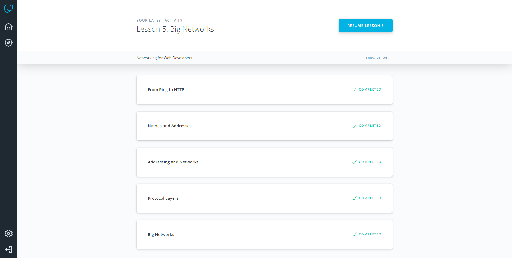

# kottans-backend

## Git and GitHub

Learned many new useful command-line flags for more productive usage of git.

## Unix Shell

### Linux Survival (4 modules)



Improved understanding of how some shell commands works. Learned about pipe output.

### Shell section on linuxcommand.org

Learned additional trick of using shell commands, filtering output and pipelines. Graceful of killing the hanged processes.

## Git Collaboration

### What is Version Control

Done in [paragraph 1](#1-git-and-github)



### GitHub & Collaboration



Something new I found in using git fetch, contributing to other projects and how to stay sync with remote repo working with a forked local one. More deeply understanding of git rebase command.

## NodeJS Basics 1

### learnyounode workshop



I got a better understanding of NodeJS basics, like starting and interacting with the HTTP server. All tasks are very interesting but the most useful for practical wise is the last one about HTTP-JSON-API server.

### functional-javascript-workshop



My previous JS experience is not so diverse and commonly limited to DOM manipulations. So there many things that were new to me, eg, blocking event looping, currying, function spies, partial application without using .bind and trampoline. Also, sometimes JS works in mysterious ways and it's hard to understand how and why to use this or that thing on real do. Thereby I need more practice for a better understanding of functional JS in some parts.

### stream adventure workshop



Streams are a very interesting and useful thing for me as a web developer. There're many new things for me, that I can use in projects. For example, piping is a really great tool for chaining actions on the same data input stream. Through module are also helpful in it. But there are some deprecated tools used in some tasks that do not give a feeling of doing something really useful.

## Memory Management

* **What's going to happen if program reaches maximum limit of stack?** If the maximum stack size has been reached, we have a stack overflow and the program receives a Segmentation Fault.

* **What's going to happen if program requests a big (more then 128KB) memory allocation on heap?** In Linux, if a large block of memory requested, will be created an anonymous mapping instead of using heap memory. 'Large' means larger than MMAP_THRESHOLD bytes, 128 kB by default.

* **What's the difference between Text and Data memory segments?** The Text Segment contains all the code from the binary. It is read-only, so trying to write to this area causes a Segmentation Fault. The Data segment contains all the read/write data which is not 0-initialized.

```
7f62d1200000-7f62d13e7000 r-xp 00000000 00:00 112221             /lib/x86_64-linux-gnu/libc-2.27.so
7f62d13e7000-7f62d13f0000 ---p 001e7000 00:00 112221             /lib/x86_64-linux-gnu/libc-2.27.so
7f62d13f0000-7f62d15e7000 ---p 000001f0 00:00 112221             /lib/x86_64-linux-gnu/libc-2.27.so
7f62d15e7000-7f62d15eb000 r--p 001e7000 00:00 112221             /lib/x86_64-linux-gnu/libc-2.27.so
7f62d15eb000-7f62d15ed000 rw-p 001eb000 00:00 112221             /lib/x86_64-linux-gnu/libc-2.27.so
7f62d15ed000-7f62d15f1000 rw-p 00000000 00:00 0
7f62d1600000-7f62d1626000 r-xp 00000000 00:00 112193             /lib/x86_64-linux-gnu/ld-2.27.so
7f62d1626000-7f62d1627000 r-xp 00026000 00:00 112193             /lib/x86_64-linux-gnu/ld-2.27.so
7f62d1827000-7f62d1828000 r--p 00027000 00:00 112193             /lib/x86_64-linux-gnu/ld-2.27.so
7f62d1828000-7f62d1829000 rw-p 00028000 00:00 112193             /lib/x86_64-linux-gnu/ld-2.27.so
7f62d1829000-7f62d182a000 rw-p 00000000 00:00 0
7f62d1970000-7f62d1972000 rw-p 00000000 00:00 0
7f62d1a00000-7f62d1a1b000 r-xp 00000000 00:00 105794             /bin/dash
7f62d1a1b000-7f62d1a1c000 r-xp 0001b000 00:00 105794             /bin/dash
7f62d1c1b000-7f62d1c1d000 r--p 0001b000 00:00 105794             /bin/dash
7f62d1c1d000-7f62d1c1e000 rw-p 0001d000 00:00 105794             /bin/dash
7f62d1c1e000-7f62d1c20000 rw-p 00000000 00:00 0
7fffeeb51000-7fffeeb72000 rw-p 00000000 00:00 0                  [heap]
7ffff5d52000-7ffff6552000 rw-p 00000000 00:00 0                  [stack]
7ffff6d3f000-7ffff6d40000 r-xp 00000000 00:00 0                  [vdso]
```

```Heap - 7fffeeb51000-7fffeeb72000```, ```Stack - 7ffff5d52000-7ffff6552000```, ```MMS - 7f62d1200000-7f62d13e7000```

Memory management is new for me at many things. I only have experience with high-level languages ​​that have garbage collection algorithms. I have never had to optimize memory usage in my applications before. Therefore, for a better understanding, I need to practice more on real cases when saving every byte of memory is really necessary.

## TCP. UDP. Network



Just a simple and cool refresh of known facts.



Many things from this course are also well known. It was useful to learn some tricks of using command-line utilities for interacting with traffic and port monitoring (like nc and tcpdump). New for me was TCP flags meanings, TTL values in ping tool. Also, I got a deeper understanding of routing and packets transmission rules. I think nc tool is very interesting for the future using in the development process.

## Http & Https

Request user info:

```curl https://api.github.com/users/IgorOsa```

Request user info with headers:

```curl -i https://api.github.com/users/IgorOsa```

Request the list of user's starred gists with credentials provided in CLI:

``` curl --user "IgorOsa:******" https://api.github.com/gists/starred```

or with password prompted:

```curl --user "IgorOsa" https://api.github.com/gists/starred```

List repositories of "Kottans" organization:

```curl -i https://api.github.com/orgs/kottans/repos```

Creating a new issue in this repository:

```curl --user "IgorOsa" -X POST -d '{"title":"Test issue","body":"Issue created for Http & Https task","labels":["test"]}' https://api.github.com/repos/IgorOsa/kottans-backend/issues```

or a way to post an issue using auth token previously created in dev settings section on GitHub:

```curl -i -H 'Authorization: token 837e******eca3' -d '{"title":"Test issue","body":"Issue created for Http & Https task using auth token","labels":["test"]}' https://api.github.com/repos/IgorOsa/kottans-backend/issues```

### Questions & answers

#### 1. Name at least three possible negative consequences of not using https

* The main negative consequence is security. All other things are going from it.
* HTTP uses an insecure connection, that easily may cause data interception by a man in the middle.
* HTTP cannot provide any strong identity checks so we can't guarantee that we sending requests to the right server.
* Users have more trust to web apps, that use secured by SSL/TLS connection so they don't need to worry about the safety of their' data.

#### 2. Explain the main idea behind public key cryptography in few sentences

This is asymmetric cryptography that means that we have a pair of security keys - public and private. The public key can be shared over the web without fear of compromising the system in which it is used. Encrypted data with public key can be decrypted only with the right private key, so it needs to hold the private key in secret.

#### 3. You are creating an application for pet clinic. You need to implement the following functionality

* add new pet (including name, age, breed, owner's name, medical history) - POST request includes in its body params age, breed, owner, etc. The server's response must be 200 (OK) or 201 (Created) with pet data in the body if the pet was added successfully, else return 400 Bad Request if error appear.
* search pet by name - it can be GET request with name in query string, response 200 and pet data in the body.
* change name of an existing pet - PUT request with name param in request body, response 200 if OK and 400 if we can't update data with name provided.
* add new info about pet's health - POST request with pet's ID and health info in body, response with 200 (OK) and data created in the response body.
* assign a pet to a particular doctor in the clinic - depending on how the database structure is implemented it can be PUT request to update a field in pets table with doctor's ID or a POST request with pet and doctor IDs into relations table.
* register an appointment for a pet. This request should include info about pet, doctor and appointment date and time - POST request with a pet and doctor IDs, appointment date and time, response with 201 Created or 400 if error.
